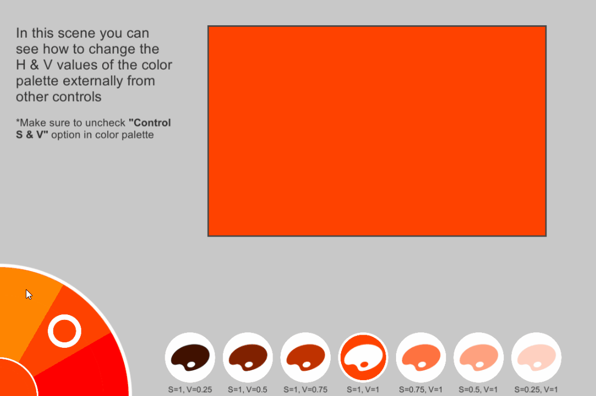

# AnotherColorPicker
**AnotherColorPicker** (**ACP**) is a simple color palette using unity UGUI. Unlike other color pickers and palettes, ACP focuses on user experience and provides a simple way for picking colors for normal users who don't know much about coloring systems and color theory.

## Why Another Color Picker?
There were two reasons for me to create another color picker:

 - **UX**: other color pickers/palettes available online are a bit complex, they are emulating the color picker used in photo editing/painting softwares which is not user friendly for kids and casual users
 - **Customization**: in this color picker colors are generated using shader which makes it easy to customize number of colors without having to create a special graphics for color wheel

## How it Works
ACP shows multiple color wheels connected together, you can think about it as a [spiral worm](https://en.wikipedia.org/wiki/Worm_drive), you can customize the number of wheels and the number of colors (segments).

### Controls:
There are two main controls:
 - Rotate the wheel to change the selected color (change color's hue)
 - Drag inward and outward to change brightness (control color's value and saturation)
 

       
### Properties & Customization:

 - **Picker**: Rect transform represent the picker position
 - **Picked Color Image**: an image that show the current selected color
 - **Color Wheel Material**: a material that is used for the color wheel, this material should use "CustomUI/ColorWheel" shader
 - **Total Number of Colors**: represents the total number of colors showed by the palette in all wheels.
 - **Wheels Count**: represents the number of wheels in the palette
 - **Starting Angle** a starting angle of the wheel (in degrees from 0 to 360), it's important to change this value if you have multiple wheels and position the palette in a position in which the right half of it is visible (e.g. left middle of the screen), so by changing this value you can hide the spawning point of colors.
 - **Control SV**: a boolean value that represent whether you want the palette to control the saturation and value of the color by dragging or you will externally changing them.
 - **Whole Segment**: whether you want the circle to rotate smoothly or to rotate segment by segment

> Written with [StackEdit](https://stackedit.io/).